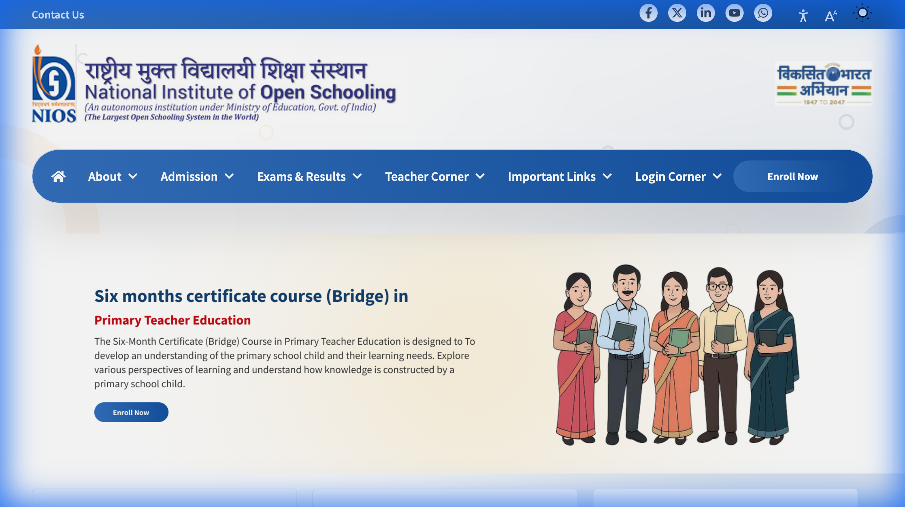

# Teacher Login Guide

This guide explains how to access the Teacher Login portal after successfully registering.

## 1. Accessing the Login Page
1. Navigate to the Home Page: `https://bridge-uat.nios.ac.in/`
2. Locate the **"Login Corner"** on the top navigation bar.
3. Hover over it to reveal the dropdown menu.
4. Click on **"Teacher Login"**.

## 2. Entering Credentials
Once on the login page (`/auth/login`), you will see the following fields:

- **Email**: Enter your registered email (e.g., `insphere.ishan@gmail.com`).
- **Password**: Enter your password (e.g., `Password@1`).
- **Verification Code (CAPTCHA)**:
    - This is a **Case-Sensitive** alphanumeric code.
    - You must enter it exactly as shown in the image.
    - If the image is unclear, you can refresh the page to get a new one.

## 3. Post-Login Verification
After clicking **Login**, you should be redirected to the **Teacher Dashboard**.
Detailed sections available on the dashboard include:
- **Syllabus**: Course materials.
- **eServices**: Administrative services.
- **Payments**: Payment history and status.
- **Workflow**: Progress tracking.

## 4. Troubleshooting
- **"Incorrect email or password"**: Double-check your credentials. Ensure Caps Lock is off for the password.
- **CAPTCHA Error**: If the login fails repeatedly, the CAPTCHA might have expired. Refresh and try again.
