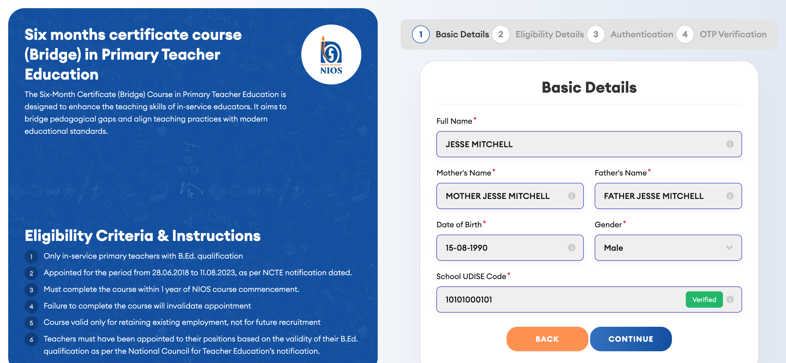
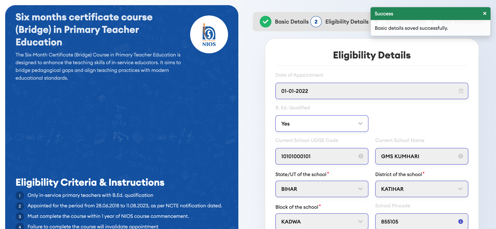
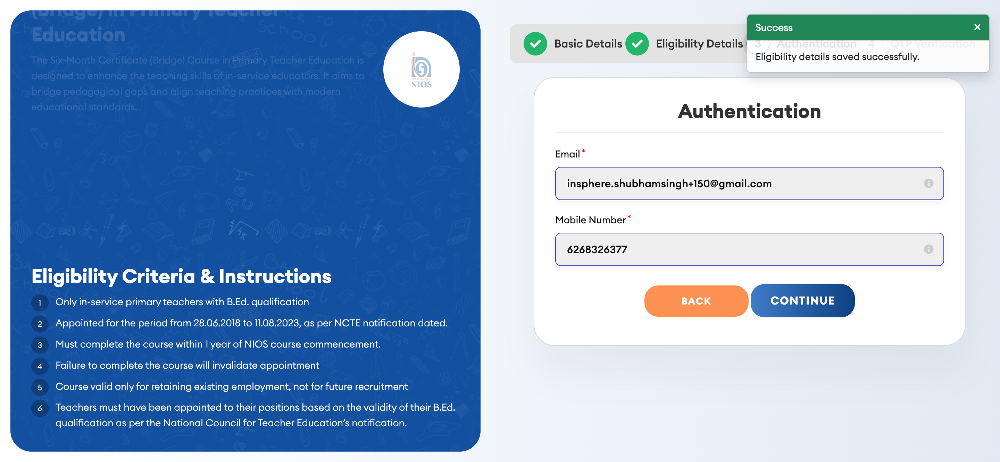
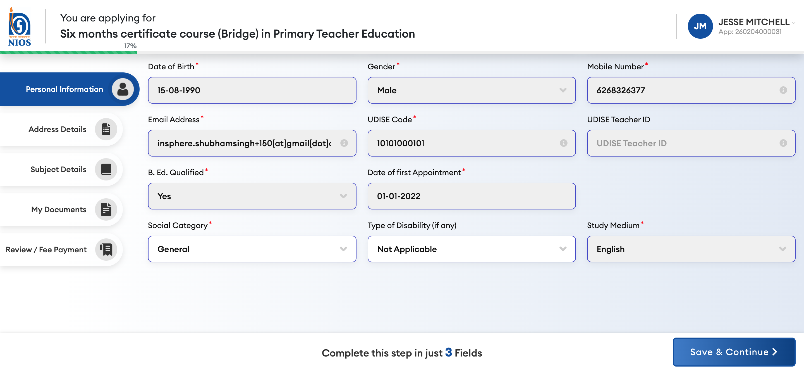
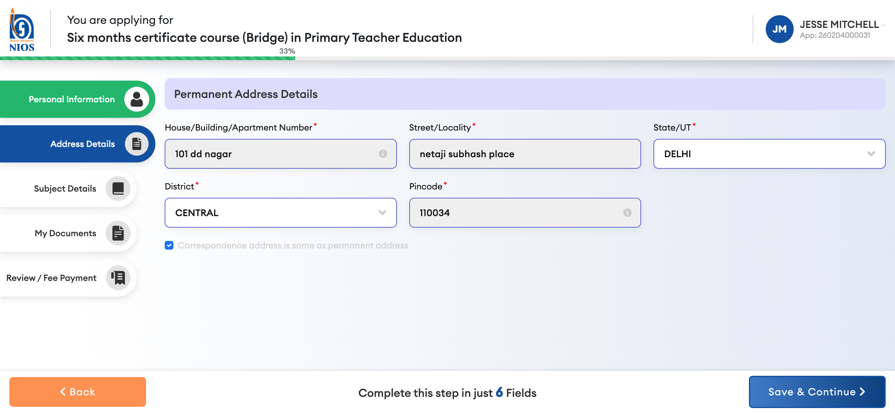
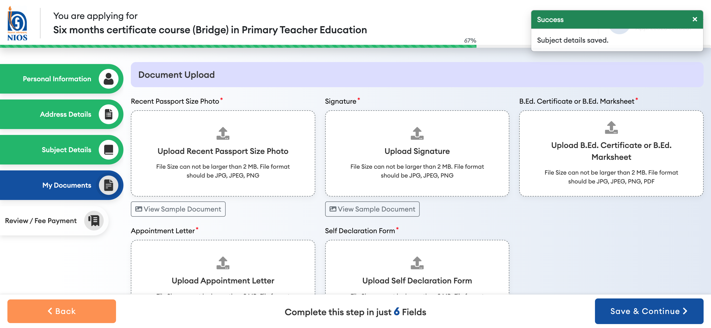
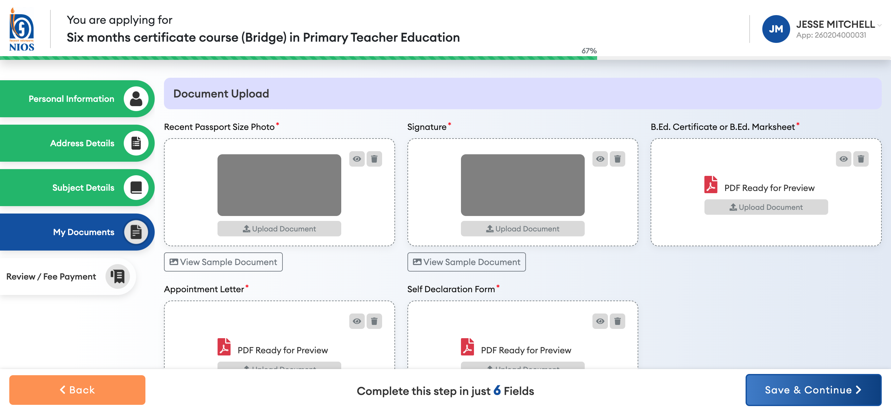
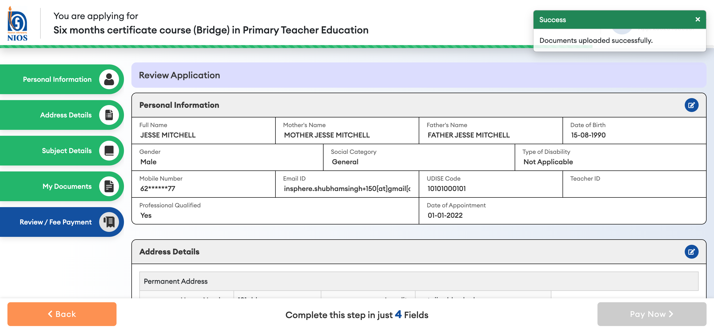
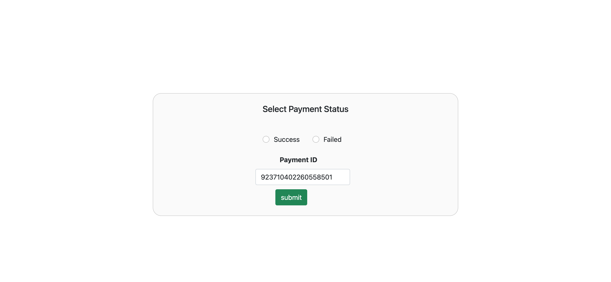

# Bridge Course: Teacher Registration User Manual

## Introduction
This guide walks through the registration process for the Bridge Course Portal. Follow these steps to complete your profile and make the payment.

## Step-by-Step Guide

### 1. Basic Details
- **Access**: Navigate to the registration URL.
- **Fields**: Enter Name, Parents' Names, DOB, Gender, and UDISE Code.
- **Verification**: Click "Verify UDISE" to check valid school codes.
- **Action**: Click **Continue**.

### 2. Eligibility Details
- **Requirement**: Enter your Date of Appointment.
- **Action**: Click **Continue**.

### 3. Authentication
- **Contact Info**: Provide a valid Email ID and Mobile Number.
- **OTP**: An OTP will be sent to your email.
- **Action**: Click **Send OTP** / **Submit**.

### 4. OTP Verification
- **Process**: Check your registered email for the OTP code.
- **Input**: Enter the 6-digit code in the browser.
- **Action**: Click **Verify**.

### 5. Personal Information
- **Fields**: Select Social Category (e.g., General, SC/ST) and Medium of Study.
- **Action**: Click **Continue**.

### 6. Address Details
- **Fields**: Enter Permanent Address details.
- **Important**: Select **State** first, then wait for **District** dropdown to load appropriate options.
- **Action**: Click **Continue**.

### 7. Subject Details
- **Process**: Mapping of subjects is often automatic.
- **Selection**: For any "Any" dropdowns, select your preferred subject.
- **Action**: Click **Continue**.

### 8. Document Upload
- **Requirements**:
    - Photo & Signature (JPG/JPEG).
    - Certificates (PDF).
- **Process**: Click "Choose File" for each document.
- **Action**: Toggle the declaration checkbox and click **Save & Continue**.

### 9. Review & Payment
- **Review**: Check all entered details on the review summary.
- **Confirmation**: Check all confirmation boxes at the bottom.
- **Gateway**: Select **SabPaisa** (or other available options).
- **Action**: Click **Pay Now**.

### 10. Payment Gateway
- **Selection**: Choose "Cards" (Credit/Debit).
- **Entry**: Enter Card Number, Name, Expiry, and CVV.
- **Completion**: Click "Pay" and wait for the Success confirmation.

## Troubleshooting
- **OTP Not Received?**: Wait 2-3 minutes or check Spam folder.
- **Dropdown stuck?**: Refresh the page and try selecting State again.
- **Payment Failed?**: Ensure you are using a valid test card or active card.
