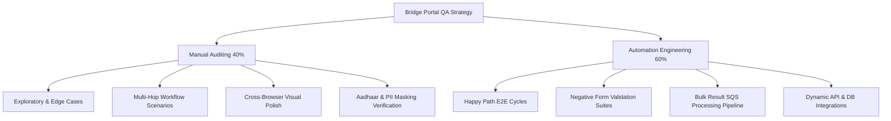

# ENTERPRISE QA BLUEPRINT & AUTOMATION STRATEGY
## Bridge Portal — Teacher Lifecycle Management System

**Document Ref:** `ISPL/2026/BRIDGE/QA/001`  
**Version:** `1.0`  
**Classification:** `Confidential — QA Architecture & Operations`  
**Target System:** `Bridge Portal Frontend (bridge.nios.ac.in) & Admin Panel (bridge-admin.nios.ac.in)`  
**Authors:** Shubham Singh (Senior QA Automation Architect & Senior Test Engineer)  
**Date:** May 2026

---

> [!NOTE]
> This master QA Blueprint translates the Bridge Portal Business Requirements (BRD v1.2) and Functional Specifications (FRD v1.0) into a comprehensive, multi-layered quality assurance execution strategy. It defines testing methodologies, test matrices, automation framework architectures, and risk mitigation protocols required to achieve 100% test coverage.

---

## 1. Quality Assurance Scope & Pillars

Our quality engineering strategy is built upon a hybrid model (60% Automated / 40% Manual) to balance rapid regression verification with deep human exploratory auditing. The framework spans across the following testing pillars:



### 1.1 Core QA Testing Pillars

1. **Manual Testing (40%)**:
   - Complex state transitions in administrative approval workflows (Multi-hop, override, escalations).
   - High-fidelity visual validation of UI/UX, responsiveness across tablets/desktops, and bilingual toggle verification (English/Hindi).
   - Exploratory edge-case testing, credential security verification, and accessibility compliance audits (WCAG 2.1 AA).

2. **Automation Testing (60%)**:
   - Regression automation covering user registration (7 stages), student dashboard modules, and E-Services (16+ profile modifications).
   - Pytest execution framework using Page Object Model (POM) architecture, integrated with parallel execution threads and HTML reporting mechanisms.
   - Core API validation for UDISE+ gating, address lookup pincode service, and background database transaction integrity checks.

---

## 2. Requirement-to-Test Mapping Matrix

Below is the traceability mapping correlating the business/functional requirements to specific automation modules and manual verification plans.

| Req ID | Requirement Description | Validation Scope | Testing Strategy | Automation Location / Manual Protocol |
| :--- | :--- | :--- | :--- | :--- |
| **BR-R-01** | UDISE+ Pre-Registration Gating | Verify registration blocks on invalid UDISE code; passes on valid. | Automated | `tests/test/registration/test_registration.py` |
| **BR-R-02** | Sequential Step Completeness | Enforce strict wizard sequence (Steps 1–10). Direct access triggers redirect. | Automated | `tests/test_field_validations.py` |
| **BR-R-03** | MFA & OTP verification gating | 6-digit OTP delivery via Email/SMS with 10-min expiry; manual entry bypass. | Hybrid | `utilities/otp_utils.py` / `tests/test/eservices` |
| **BR-R-04** | Form Auto-Uppercase & Regex | Text fields convert to uppercase. Numbers and DOB picker validated. | Automated | `tests/test_field_validations.py` |
| **BR-R-06** | Financial Clearance hard requirement | Payment confirmation from SabPaisa gates final application status updates. | Automated | `pages/payment_flow_page.py` |
| **BR-R-07** | SNO Approval -> Icard/Cert Gen | Verify Identity Cards generate *only* after SNO 100% approval status. | Manual | Manual exploratory review of state approvals. |
| **BR-R-08** | Result Immutability | Published results must be read-only in frontend and database. | Automated | `tests/exam/test_technical_audit.py` |
| **BR-R-09** | HQ Approval -> Enrollment Gen | Verify Enrollment Number generation only on Central HQ final approval. | Hybrid | Admin approval simulation script + manual DB validation. |
| **BR-R-14** | Double-Payment Detection | Secondary payment requests block, alerting user or scheduling refunds. | Automated | `tests/test_regression_stage5_6.py` |
| **BR-R-15** | Admin MFA (TOTP Setup) | Admin accesses sensitive modules *only* after verification of Google Authenticator. | Manual | Manual validation of TOTP barcode scanning & lockouts. |
| **NFR-P-03** | SQS Chunked Result Processing | Verify bulk DBF uploads parse, push to SQS queue, and insert without leakage. | Automated | `tests/exam/test_technical_audit.py` |

---

## 3. Comprehensive Module Test Matrices

### 3.1 Module 1: User Authentication & Registration (7-Stage Wizard)

#### Scenario Matrix
- **TC-REG-001 (Positive)**: Happy path registration. Fill valid UDISE, complete cascading state/district details, receive OTP, fill biographical data, select subjects, upload valid JPG (1.5 MB), simulate SabPaisa card payment.  
  *Expected:* Dynamic Enrollment number generated, status changes to `PENDING`, S3 document pathways populated, and audit logging entries created.
- **TC-REG-002 (Negative)**: Enter invalid 11-digit UDISE.  
  *Expected:* API call fails, inline red error "UDISE Code not found in national database", "CONTINUE" button remains locked.
- **TC-REG-003 (Negative)**: Attempt B.Ed eligibility block. Select B.Ed Qualified = `No`.  
  *Expected:* Dynamic popup warning stating ineligibility, progression blocked.
- **TC-REG-004 (Edge)**: Document size boundary limit. Upload a PDF of size 2.1 MB (Limit is 2.0 MB).  
  *Expected:* Form validation alerts user, upload blocks, submit button disabled.
- **TC-REG-005 (Security)**: Session hijack check. Direct URL navigation to `/registration/document-upload` without basic details.  
  *Expected:* System checks session cookies, detects incomplete stages, redirects to `/registration/basic-details` with warning toast.

---

### 3.2 Module 2: E-Services (16+ Profile Modifications)

#### Scenario Matrix
- **TC-ESV-001 (Positive)**: Apply for `Change Appointment Date` service. Fill dynamic date picker, upload appointment letter (PDF), enter OTP received in wait loop, execute SabPaisa UAT payment simulation.  
  *Expected:* Service request registered in dashboard, transaction ID saved, workflow entry set to `PENDING` regional office review.
- **TC-ESV-002 (Negative)**: Submit empty form for `Change Disability Category`.  
  *Expected:* Page displays HTML5 validation errors, submission fails, URL remains unchanged (no redirect to payment).
- **TC-ESV-003 (Positive)**: Dynamic E-Service discovery check. The test suite automatically navigates to `/eservices/apply`, scrapes all active list selectors, filters out skipped modules, and sequential checks every service.  
  *Expected:* Test suite adapts dynamically without failing, executing workflow forms sequentially.

---

### 3.3 Module 3: Exam Management & Bulk Result Processing (SQS Pipeline)

#### Scenario Matrix
- **TC-EXM-001 (Positive)**: Exam Registration. Gated validation checks active enrollment, late fee rules calculated on past-date boundaries, generates hall ticket PDF containing correct QR codes.  
  *Expected:* Downloadable PDF contains matching student credentials and study center allocations.
- **TC-RST-002 (Positive/API)**: Upload result DBF file containing 10,000 records.  
  *Expected:* System triggers staged pipeline: creates `ResultStat` -> populates `ResultBasket` in chunks -> pushes 100-record chunk tasks to SQS queue -> worker pool executes insertions -> real-time status counters increment -> student dashboard updates.
- **TC-RST-003 (Negative/Error Recovery)**: Upload corrupted result DBF.  
  *Expected:* Worker detects invalid byte offsets, stops execution, triggers transactional rollback, sets pipeline state to `FAILED`, and logs the trace in administrative audit panels.

---

### 3.4 Module 4: Admin / Back-Office Panel & Subject Expert Management (SME)

#### Scenario Matrix
- **TC-SME-001 (Positive)**: SME self-registration wizard (8 steps). Complete all biographical data, enter valid PAN format `[A-Z]{5}[0-9]{4}[A-Z]`, qualification details with mandatory board selections, and submit B.Ed certificate PDF.  
  *Expected:* Request registered successfully, state changed to `PENDING_APPROVAL`, dashboard locks SME options until SNO reviews.
- **TC-SME-002 (Negative)**: Enter invalid PAN format (e.g. `ABC12345Z` or containing lowercase letters).  
  *Expected:* Dynamic regular expression validation triggers inline red warning, next button remains locked.
- **TC-SME-003 (Negative)**: Skip mandatory Qualification Board field and hit Next.  
  *Expected:* User-friendly validation error "Board/University is required" displays; raw DB exception prevented.
- **TC-SME-004 (Edge)**: Attempt to edit expert subject mappings while TMA evaluations are in-progress.  
  *Expected:* System locks the allocation table, prevents subject re-mapping, displays restriction toast.

---

### 3.5 Module 5: Academic Assignments (TMA) & Evaluation Lifecycle

#### Scenario Matrix
- **TC-TMA-001 (Positive)**: End-to-end assignment submit-to-grade workflow. Student uploads assignment PDF, SME logs in, previews assignment using sidebar viewer, enters valid marks (e.g., 18/20), and clicks Submit.  
  *Expected:* Status synchronized immediately to `Evaluated` in both SME portal and student dashboard view.
- **TC-TMA-002 (Negative)**: SME enters assignment evaluation marks greater than the configured maximum (e.g., 22 out of 20).  
  *Expected:* System blocks submission, displays weightage validation alert, rolls back transaction.
- **TC-TMA-003 (Negative/Security)**: SME attempts to view or grade an assignment for a subject or medium they are not allocated to.  
  *Expected:* Request is unauthorized, dashboard blocks action, security exception logged in audit logs.

---

### 3.6 Module 6: Dynamic Dashboards, Reports & Async S3 Exports

#### Scenario Matrix
- **TC-RPT-001 (Positive)**: Async Excel report export. Admin selects columns, chooses Academic Year filter, and clicks Export.  
  *Expected:* Background worker starts, pushes job to SQS queue, exports rows to S3, returns secure, time-limited presigned URL token.
- **TC-RPT-002 (Negative)**: Run report export with empty dates or future boundary periods.  
  *Expected:* Validation alerts "Start date cannot be in the future", grid locks export actions.

---

### 3.7 Module 7: Notifications & SMS/Email Alert Logs

#### Scenario Matrix
- **TC-NTF-001 (Positive)**: OTP delivery verification. Perform login/e-service request.  
  *Expected:* Transactional email (SES) and SMS gateway API trigger within 5 minutes, correct Sender ID verified.

---

## 4. Automation Framework Architecture

The framework is structured using a robust Page Object Model (POM) pattern in Python, leveraging `pytest` as the test runner, `selenium` as the core web driver controller, and dynamic helper modules for handling OTP, Payments, and Data generations.

### 4.1 Folder Structure Directory Tree

```
c:\AutomationProjects\Bridge-Automation.-Framework-\
├── config/
│   ├── config.ini                  # Credentials, URLs, and browser profiles
│   └── pytest.ini                  # Test execution markers and settings
├── constants/
│   └── locators.py                 # Centralized repository of CSS and XPath locators
├── pages/
│   ├── base_page.py                # Wrapper for Selenium action methods (clicks, waits, scripts)
│   ├── login_page.py               # User and Admin login flows + CAPTCHA handling
│   ├── registration_page.py        # 7-stage registration pages
│   ├── eservices_page.py           # E-Service scraper and dynamic form action pages
│   └── payment_flow_page.py        # Gateway interface and UAT SabPaisa simulator
├── tests/
│   ├── conftest.py                 # ChromeDriver setup, system configurations, and setup hooks
│   ├── test/
│   │   ├── auth/                   # Authentication functional and negative suites
│   │   ├── registration/           # Registration E2E and field validations
│   │   └── eservices/              # Dynamic services and negative tests
│   └── exam/                       # TMA, Exam registration, and Result SQS pipeline tests
├── utilities/
│   ├── custom_logger.py            # Logger instances dynamically writing to /logs
│   ├── data_utils.py               # Random name, phone, dob generators
│   └── otp_utils.py                # OTP listener loops and manual verification pauses
├── docs/
│   ├── manuals/                    # Manual files, user manuals, and blueprint
│   └── executions/                 # HTML reports automatically output after bat runs
├── RUN_BATCH_REGISTRATION.bat      # Batch registration executable gateway
└── RUN_ESERVICES_TESTS.bat         # Premium, interactive E-Services test gateway
```

### 4.2 Sample BasePage Implementation (`pages/base_page.py`)

```python
import time
from selenium.webdriver.support.ui import WebDriverWait
from selenium.webdriver.support import expected_conditions as EC
from selenium.webdriver.common.action_chains import ActionChains

class BasePage:
    def __init__(self, driver):
        self.driver = driver
        self.wait = WebDriverWait(driver, 15)

    def do_click(self, locator):
        """Standard explicit wait click wrapper."""
        element = self.wait.until(EC.element_to_be_clickable(locator))
        element.click()

    def do_send_keys(self, locator, text):
        """Explicit wait send_keys wrapper."""
        element = self.wait.until(EC.visibility_of_element_located(locator))
        element.clear()
        element.send_keys(text)

    def js_click(self, element):
        """Nuclear JS click for stubborn overlapping elements."""
        self.driver.execute_script("arguments[0].click();", element)

    def scroll_into_view(self, element):
        """Scrolls center block target cleanly."""
        self.driver.execute_script("arguments[0].scrollIntoView({block: 'center'});", element)
```

### 4.3 Sample Payment Simulator Flow (`pages/payment_flow_page.py`)

```python
from selenium.webdriver.common.by import By
from pages.base_page import BasePage
import time

class PaymentFlowPage(BasePage):
    checkbox_confirmations = (By.XPATH, "//input[@type='checkbox']")
    btn_sabpaisa = (By.XPATH, "//label[contains(text(), 'SabPaisa') or contains(text(), 'BOI')]")
    btn_pay_now = (By.XPATH, "//button[contains(text(), 'Pay Now') or contains(text(), 'Proceed to Payment')]")
    
    def check_all_confirmation_boxes(self):
        checkboxes = self.driver.find_elements(*self.checkbox_confirmations)
        for cb in checkboxes:
            if not cb.is_selected():
                self.scroll_into_view(cb)
                self.js_click(cb)

    def select_sabpaisa_gateway(self):
        self.do_click(self.btn_sabpaisa)

    def click_pay_now(self):
        self.do_click(self.btn_pay_now)

    def process_standard_payment(self, card_details):
        """
        Executes standard SabPaisa UAT card inputs or bypasses using UAT success buttons.
        """
        # SabPaisa sandbox uses dynamic page content
        time.sleep(3)
        if "sabpaisa" in self.driver.current_url.lower():
            # Nuclear UAT Simulator Action
            self.driver.execute_script("""
                var successRadio = document.querySelector("input[value='success']") || document.querySelector("input[value='SUCCESS']");
                if (successRadio) {
                    successRadio.click();
                    successRadio.checked = true;
                }
                var btn = document.getElementById("submit") || document.querySelector("button.btn-success");
                if (btn) btn.click();
            """)
            time.sleep(5)
```

---

## 5. Execution Rules & Dynamic Data Strategy

### 5.1 Dynamic Data Generation
Using static data causes database primary key collisions and email duplicates (Rule: `One Active Application per user`). To prevent this, we utilize dynamic utilities (`utilities/data_utils.py`):
*   **Unique Incremental Emails**: Reads and updates `test_data/email_counter.txt` to generate sequential test emails (e.g., `teststudent104@gmail.com`).
*   **Aadhaar Generating Offset**: Dynamic 12-digit numbers meeting Verhoeff algorithm validators.
*   **Mock Name Pools**: Standard name pools auto-converted to UPPERCASE to satisfy database validators.

### 5.2 Manual Verification Interceptor
To avoid failures on pages requiring real-time external notifications (OTP, CAPTCHA), the framework implements **Manual verification loops**:

```mermaid
sequenceDiagram
    participant Driver as Automation Script
    participant User as Human Tester
    participant Browser as Portal Interface

    Driver->>Browser: Enters email and password
    Driver->>Browser: Launches manual wait loops (120 seconds)
    Note over User,Browser: Watch browser screen!
    User->>Browser: Manually reads CAPTCHA and enters it
    User->>Browser: Clicks "Login" button
    loop Every 2 seconds
        Driver->>Browser: Checks current URL or DOM changes
    end
    Browser-->>Driver: URL changes to dashboard
    Note over Driver: Wait loop exits; automated testing resumes!
```

---

## 6. Risk Mitigation & Error Recovery Protocols

| Risk Identifier | Scenario | Impact | Mitigation Strategy | Recovery Protocol |
| :--- | :--- | :--- | :--- | :--- |
| **RM-01** | Chrome/Driver Version Mismatch | **CRITICAL** | Automated WebDriver management (`ChromeDriverManager`) in `conftest.py`. | Dynamically downloads correct version matching local Chrome updates on launch. |
| **RM-02** | UAT Network Lag | **HIGH** | Replacing all `time.sleep` triggers with customized explicit waits (`WebDriverWait`). | Standardizes 15-second element load thresholds before throwing exceptions. |
| **RM-03** | Sandbox/Gateway Outages | **HIGH** | Implementation of bypass simulator flags inside properties configs. | Automatically skips actual banking screens, generating mock success responses. |
| **RM-04** | Dual Session Terminations | **MEDIUM** | Ensuring every test class setup launches with clear cookies and fresh driver instances. | `driver.delete_all_cookies()` inside the fixture teardown blocks. |

---

## 7. QA Framework Best Practices

1. **Assertion Standard**: Never use raw asserts without custom messaging. Ensure exact context is specified (e.g., `assert "dashboard" in self.driver.current_url.lower(), "Failure: Login did not redirect user to Dashboard page!"`).
2. **Selector Prioritization**: Centralize elements within `constants/locators.py`. Prioritize selectors by:
   - `By.ID` (Unique and fastest)
   - `By.NAME` / `By.CSS_SELECTOR` (Sleek and robust)
   - `By.XPATH` (Use only when traversing text nodes or complex ancestors)
3. **Flaky Test Retries**: Configured `pytest-rerunfailures` in `pytest.ini` with standard `reruns = 2` parameters to filter out network anomalies or rendering delays.
4. **Log Cleanliness**: Avoid logging raw Aadhaar, passwords, or transaction secure codes. Use loggen patterns to write system entries cleanly inside `/logs`.
